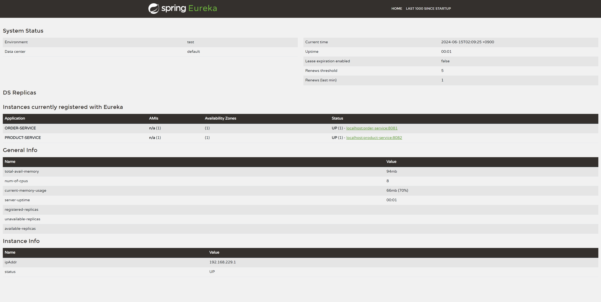
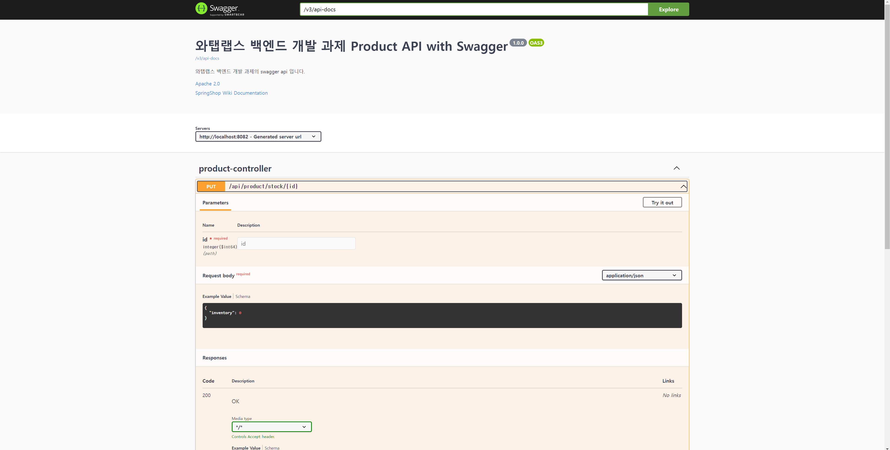

# 와탭랩스 백엔드 과제

---

## 개발 기간
2024-06-11 ~

## Eureka 서버 구축
기초적인 CRUD product와 order service를 Instance 등록하였습니다.<br>
프로젝트 실행 후, 아래의 링크에 접속해서 테스트할 수 있습니다.<br>
http://localhost:8761/

<br><br>

## Swagger API 명세서

커스텀은 다음의 링크를 참고하여 만들었습니다. [블로그 링크](https://leeeeeyeon-dev.tistory.com/92#google_vignette) / [깃허브 링크](https://github.com/TeamDilly/Packy-Server/blob/main/packy-api/src/main/java/com/dilly/global/config/SwaggerConfig.java)

API 명세서는 Swagger로 작성되어 있습니다.<br>
프로젝트 실행 후, 아래의 링크에 접속해서 API를 테스트할 수 있습니다.<br>
Order API : http://localhost:8081/swagger-ui/index.html <br>
Product API : http://localhost:8082/swagger-ui/index.html <br>

<br><br>

## 프로젝트 사용 기술
Spring Boot 2.7.15 (Maven) + Java17, MySQL 8.x, JPA 
<br><br>

## 프로젝트 폴더 구조

    폴더 구조 작성 cmd 명령어 : 'tree > level.txt' 

```
├─api-gateway
│  ├─src
│  │  ├─main
│  │  │  ├─java
│  │  │  │  └─io
│  │  │  │      └─whatap
│  │  │  │          └─apigateway

├─order
│  ├─src
│  │  ├─main
│  │  │  ├─java
│  │  │  │  └─io
│  │  │  │      └─whatap
│  │  │  │          └─order
│  │  │  │              ├─controller
│  │  │  │              ├─domain
│  │  │  │              ├─dto
│  │  │  │              │  ├─order
│  │  │  │              │  └─product
│  │  │  │              ├─global
│  │  │  │              │  ├─annotation
│  │  │  │              │  ├─client
│  │  │  │              │  ├─common
│  │  │  │              │  ├─config
│  │  │  │              │  ├─exception
│  │  │  │              │  │  └─error
│  │  │  │              │  └─swagger
│  │  │  │              ├─repository
│  │  │  │              └─service

├─product
│  ├─src
│  │  ├─main
│  │  │  ├─java
│  │  │  │  └─io
│  │  │  │      └─whatap
│  │  │  │          └─product
│  │  │  │              ├─controller
│  │  │  │              ├─domain
│  │  │  │              ├─dto
│  │  │  │              ├─global
│  │  │  │              │  ├─annotation
│  │  │  │              │  ├─common
│  │  │  │              │  ├─config
│  │  │  │              │  ├─exception
│  │  │  │              │  │  └─error
│  │  │  │              │  └─swagger
│  │  │  │              ├─repository
│  │  │  │              └─service

```
<br>

## 런타임 구동

아래 링크에 들어가 내용을 참고하고 프로젝트를 실행시킬 수 있습니다.
[자세한 내용 참고](https://foregoing-session-2ae.notion.site/a57d70130bd34b31ae953094673bec1a?pvs=4)

Environment variables는 다음과 같습니다.

    DB_HOST=;DB_NAME=;DB_PASSWORD=;DB_PORT=;DB_USERNAME=;DDL_AUTO=;
<br>

## Commit Convention
| value | meaning |
| -- | -- |
| feat | 새로운 기능 추가 시 |
| add | 새로운 클래스 추가 시 |
| docs | 문서 변경 사항 추가 시 |
| fix | 수정 사항 추가 시 |
| refactor | 코드 품질 개선 시 |
| move | 파일 또는 폴더 이동 시 |
| test | 테스트 관련 사항|
<br>

## 개념 설명

1. @SpringBootApplication이 수행하는 역할
2. ComponentScan이란?
   
   @SpringBootApplication 어노테이션의 구조
   ```java
   @Target({ElementType.TYPE})
   @Retention(RetentionPolicy.RUNTIME)
   @Documented
   @Inherited
   @SpringBootConfiguration
   @EnableAutoConfiguration
   @ComponentScan(excludeFilters = {@Filter(type = FilterType.CUSTOM, classes = {TypeExcludeFilter.class}),
   @Filter(type = FilterType.CUSTOM, classes = {AutoConfigurationExcludeFilter.class})})
   public @interface SpringBootApplication {
      ...
   }
   ```
   - 커스텀 단순 설정
     - @Target({ElementType.TYPE}) : TYPE = 클래스, 인터페이스 등에서 사용되는 어노테이션이라는 것을 정의
     - @Retention(RetentionPolicy.RUNTIME) : 지속 시간 RUNTIME = 가장 긴 시간. 실행 시 사용.
     - @Documented : javadoc에서 작성한 문서에 포함시키겠다.
     - @Inherited : 자동 상속. 자식 클래스는 부모의 어노테이션을 사용할 수 있다.<br><br>
        
   - 중요 역할 3가지 어노테이션
     1. @SpringBootConfiguration
        ```
        계층 구조
        @SpringBootApplication
        -------> @SpringBootConfiguration
             -------> @Configuration
        ```
           
         - 스프링에서는 spring(=IoC) container 로 객체를 관리하는데, 이때 관리되는 객체를 Bean이라고 한다.
         - @Configuration은 @Bean으로 정의된 메소드를 빈으로 등록하고 사용하는데 도움을 주는 어노테이션이다. → 설정 파일임을 말해줌
         - ? : @Bean으로만 등록할 수 없을까? -> 가능은 하지만 싱글톤 보장이 없다.<br><br>
        
     2. @ComponentScan
        - @Component가 붙은 (찾는 범위 지정 가능) 해당 범위의 클래스들을 찾아 스캔해서 자동으로 스프링 빈으로 등록해주는 어노테이션 <br><br>
           
     3. @EnableAutoConfiguration
        - auto-configuration 가능
          - 기존 spring에서는 직접 XML 작성으로 configuration을 해야 했다.
          - 하지만 spring boot에서는 classpath에 jar파일이 존재할 경우 자동으로 configuration을 해준다.
          - 그렇다면 @ComponentScan과 @EnableAutoConfiguration 중 누가 먼저 실행되어 빈을 등록할까?
              - 1단계 : @ComponentScan
              - 2단계 : @EnableAutoConfiguration<br><br>
            
3. @Autowired 동작 과정 [자세한 내용](https://beststar-1.tistory.com/40)
   - 객체 타입에 해당하는 빈을 찾아 자동 주입하는 역할
     - 빈이란? 스프링에서 spring(=IoC) container가 관리하는 객체를 말한다.
   - 그렇다면, 무엇으로 어떻게 빈을 찾아 주입하는 걸까? <br><br>
     - BeanPostProcessor 라는 라이프 사이클 인터페이스 구현체인 AutowiredAnnotationBeanPostProcessor에 의해 이루어진다.
4. Spring Bean LifeCycle
   - 빈의 라이프사이클은 크게 '객체생성 - 의존관계 설정 - 초기화 - 소멸' 순으로 나눈다.
     
     <div style="text-align:center">빈 라이프사이클 도식화</div>
   - 파란색으로 표시한 부분이 BeanPostProcessor 내용입니다. BeanPostProcessor에는 2가지 메서드로
     - postProcessBeforeInitialization : 빈 초기화 단계 이전 (의존관계 설정) -> 빈을 찾을 수 있는 메서드
     - postProcessAfterInitialization : 빈 초기화 단계 이후 (소멸)
   - 하지만, BeanPostProcessor도 인터페이스이기 때문에 구현체가 있어야 메서드를 이용할 수 있습니다.
   
     <div style="text-align:center">BeanPostProcessor과 AutowiredAnnotationBeanPostProcessor</div><br>
   - AutowiredAnnotationBeanPostProcessor - processInjection(Object bean) 메서드 : 빈의 클래스 정보 읽어오는 getClass()로 메타데이터 얻고 주입 inject()를 실행시켜 주입을 합니다.<br>
   -> inject() 출처 : AutowiredAnnotationBeanPostProcessor -> InjectMetadata 상속 받는 : AutowiredFieldElement와 AutowiredMethodElement - 오버라이딩 inject()
     - inject() -> ReflectionUtils.makeAccessible() : 정보 + invoke() : 빈 주입
   <br><br>
     
5. RestTemplate [자세한 내용](https://minkwon4.tistory.com/178)
   - 백엔드 서버에서 다른 서버로 통신해야 하는 경우, HTTP 통신 관련 코드 작성 또는 라이브러리 써야함.
   - 자바 언어로 작성된 HTTP 통신용 클라이언트 라이브러리 ex. OkHttp, Retrofit 등 존재
   - 스프링에서는 기본적으로 RestTemplate HTTP 클라이언트를 제공함<br><br>
   - **동작 원리**<br><br>
     <br><br>
     1. 애플리케이션 내부에서 REST API에 요청하기 위해 RestTemplate의 메서드를 호출한다.
     2. HttpMessageConverter를 이용해 RequestEntity를 요청메시지로 변환
     3. ClientHttpRequestFactory로 ClientHttpRequest를 가져와 요청 보냄
     4. ClientHttpRequest는 요청 메시지를 만들어 HTTP 프로토콜을 통해 외부 서버와 통신
     5. ClientHttpResponse로 응답을 받고, ResponseErrorHandler에서 오류를 처리합니다.
     6. HttpMessageConverter를 이용해 응답메시지를 Java Object(Reseponse Type)로 변환하고
     7. 이를 애플리케이션에 반환합니다.<br><br>

   - **RestTemplate 메소드**
     
     | 메소드 | HTTP | 설명                              |
     | --- | ---- |---------------------------------|
     | getForObject | GET | HTTP GET 요청 후 객체로 응답            |
     | getForEntity | GET | HTTP GET 요청 후 ResponseEntity로 응답 |
     | postForLocation | POST | HTTP POST 요청 후 헤더에 저장된 URL을 응답  |
     | postForObject | POST | HTTP POST 요청 후 객체로 응답 |
     | postForEntity | POST | HTTP POST 요청 후 ResponseEntity 응답 |
     | delete | DELETE | HTTP DELETE 요청 |
     | headForHeaders | HEADER | HTTP HEAD 요청 후 헤더 정보 응답 |
     | put | PUT | HTTP PUT 요청 |
     | patchForObject | PATCH | HTTP PATCH 요청 후 객체 응답 |
     | optionsForAllow | OPTIONS | 지원하는 HTTP 메소드를 조회 |
     | exchange | Any | 원하는 HTTP 메소드 요청 후 ResponseEntity 응답 |
     | execute | Any | Request/Response 콜백 수정 |
    <br>

   - **Github API 접근 예제**
     ```java
     @GetMapping(value = "/github/{user}", produces = MediaType.APPLICATION_JSON_VALUE)
     public String githubUser(@PathVariable("user") String user) {
     // RestTemplate 생성
     RestTemplate restTemplate = new RestTemplate();

     // 요청 메시지 생성 및 설정
     HttpHeaders headers = new HttpHeaders();
     headers.setContentType(MediaType.APPLICATION_JSON);
     
     // 요청 메시지에 바디 데이터가 없으므로 Void 타입으로 설정
     RequestEntity<Void> requestEntity = new RequestEntity<>(
            null, headers, HttpMethod.GET, URI.create("https://api.github.com/users/" + user));

     // 응답 메시지
     ResponseEntity<String> response = restTemplate.exchange(requestEntity, String.class);
     // 응답 메시지의 바디 데이터를 문자열로 해석
     String responseBody = response.getBody();
 
     return responseBody;
     ```

<br>
6. @OneToMany, @ManyToOne : entity의 연관관계 지정해주는 어노테이션
   - 엔티티들은 다양한 연관관계 지정 가능<br><br>

   1. 방향
   - 단방향 : 한 쪽의 엔티티만 참조하고 있음. (-> 나 <-)
   - 양방향 : 양 쪽이 서로 참조하고 있음. (<->) <br><br>

   2. 연관관계의 종류 및 어노테이션

       | 연관관계  | 어노테이션 |
       |-------| ---- |
       | 1 : 1 | @OneToOne |
       | 1 : N | @OneToMany |
       | N : 1 | @ManyToOne |
       | N : M | @ManyToMany |
<br>

   3. 코드 작성 및 설명
  - 예를 들어 한 사람이 여러 게시물을 만들 수 있다.<br>
    -> 한 사람 기준 one(1) - 여러 게시물 기준 many(n)

    ```java
    @Entity
    public class Post {
        @Id
        @GeneratedValue(strategy = GenerationType.IDENTITY)    
        private Long id;
    
        @ManyToOne // post - many, user - one
        @JoinColumn(name = "user_id")    
        private User user;
    }
    
    @Entity
    public class User {
        @Id
        @GeneratedValue(strategy = GenerationType.IDENTITY)
        private Long id;
    
        @OneToMany(mappedBy = "user") // user - one, post - many
        private List<Post> posts = new ArrayList<>();
    }
    ```

    - 의문점 : 연관관계 작성할 때 @ManyToOne, @OneToMany만 있으면 될 것 같습니다. -> @JoinColumn과 mappedBy는 왜 작성하셨나요?
    - 게시글은 누가 작성했는지 User의 값을 알 수 있고, 반대로 User는 List<Post>로 어떤 게시물들을 작성했는지 알 수 있습니다.
    - 그런데 가정을 해보도록 하겠습니다. 만약 유저가 게시물 하나를 작성했습니다.
    - 게시물 작성하여 이제 데이터베이스에 이 내용을 저장해야합니다.
    - 그렇다면 Post 클래스 - User를 넣어야할까요? / User 클래스 - List에 넣어야할까요?
    - JPA 입장에서는 혼란이 올 수 밖에 없습니다. 따라서 누굴 우선으로 할지 주인을 결정 해야 합니다.
       - @ManyToOne = 1개의 외래키만 가지고 있음 > @OneToMany = List 여러개의 값을 가지고 있음.<br>
       -> 즉, 관리면에서 한개의 외래키만 가지고 있는 것이 효율적임.
       - 주인이라면 : @JoinColumn / 주인이 아니라면 : mappedBy 를 작성합니다.<br><br>
       - @JoinColumn : 외래 키를 매핑할 때 사용 (name = : 외래키 컬럼명 지정)<br>
         - name = : 단순히 컬럼명만 지정
         - referencedColumnName = : 대상 테이블의 어떤 컬럼을 참조할 것인지 지정 
       - mappedBy : 연관관계의 주인을 지정 (단, 연관관계 주인의 해당 속성 필드명과 일치)
<br><br>
      
    1. 그 밖의 편의 옵션
       1. 프록시 옵션 : fetch
          - DB 조회 시, 연관관계의 엔티티 정보를 언제 요청할 것인지
          - LAZY : 데이터가 필요한 시점에 정보를 요청함. (즉, 쿼리를 2번 보냄)
          - EAGER : 조인으로 바로 모든 정보를 요청함. (즉, 쿼리는 1번 + @OneToOne, @ManyToOne 어노테이션 기본 설정값)
          - 특별히 반드시 가져와야 할 정보가 아니라면 LAZY를 선택하는 것이 좋음.<br><br>
      
       2. 영속성 옵션 : cascade
          - 쉽게 말해 부모 엔티티를 다룰 때, 자식 엔티티도 함께 다루는 것
          - 6가지 옵션으로, ALL, PERSIST, MERGE, REMOVE, REFRESH, DETACH이 있음. [자세한 설명](https://data-make.tistory.com/668)
          - 단, REMOVE는 주의 필요 [자세한 설명](https://velog.io/@yuseogi0218/JPA-CascadeType.REMOVE-vs-orphanRemoval-true)
            - REMOVE : 부모 엔티티와 자식 엔티티의 연관관계를 제거할 때, 자식 엔티티가 DB에 남아있으며 외래키 값만 변경됨.<br>
            -> 해결 : orphanRemoval = true -> 자식 엔티티를 고아 객체로 취급하여 DB에서 삭제시킴.
   
<br>

## 프로젝트 코드 설명

1. **Entity**
   1. Entity와 DTO는 분리하는 [이유](https://hstory0208.tistory.com/entry/SpirngJPA-Dto%EC%99%80-Entity%EB%A5%BC-%EB%B6%84%EB%A6%AC%ED%95%B4%EC%84%9C-%EC%82%AC%EC%9A%A9%ED%95%98%EB%8A%94-%EC%9D%B4%EC%9C%A0)
      1. 사용자가 필요한 데이터만 DTO에 전달하기
      2. JSON 직렬화 이슈 해결
      3. 민감한 정보는 노출되지 않는 보안성 강화
      
      -> Entity와 DTO 간 변환 메서드 구현하기 (toEntity() <-> toDto())<br><br>
      
   2. Entity로 선언된 클래스는 모든 필드를 컬럼으로 취급
      
      -> @Column(name=)은 클래스의 필드명과 데이터베이스의 필드명이 다를 경우에 사용하기<br><br>
      
   3. 생성자와 getter, setter 어노테이션 -> Lombok 이용하기
      1. 생성자
         - 파라미터가 없는 생성자 : @NoArgsConstructor<br>
           단, 접근 제어자는 PROTECTED로 하는 [이유](https://erjuer.tistory.com/106)<br>
           -> (즉시 로딩 제외) 자연 로딩(LAZY) 인 경우 실제 엔티티가 아닌 프록시 객체를 통해서 조회
           - private인 경우 : 프록시 객체 생성에 접근 불가능
           - public인 경우 : 무분별한 객체 생성 초래 + setter로 통한 값 주입 -> 값 변경 추적 어려움<br><br>
         - 모든 파라미터가 있는 생성자
           1. @AllArgsConstructor [문제점](https://velog.io/@joona95/RequiredArgsConstructor-AllArgsConstructor-%EC%82%AC%EC%9A%A9%EC%9D%80-%EC%A7%80%EC%96%91%ED%95%98%EC%9E%90)
           2. Builder 패턴 [은 무엇이고 사용하는 이유](https://velog.io/@rara_kim/Spring-Builder-%ED%8C%A8%ED%84%B4%EC%9D%80-%EC%99%9C-%EC%82%AC%EC%9A%A9%ED%95%98%EB%8A%94-%EA%B2%83%EC%9D%BC%EA%B9%8C)
           
           -> '첫번째 < 두번째'<br><br>

   4. PK 매핑 전략 [자세한 내용](https://fourjae.tistory.com/entry/Spring-boot-JPA-%EA%B8%B0%EB%B3%B8-%ED%82%A4-%EC%83%9D%EC%84%B1-%EC%A0%84%EB%9E%B5AUTO-IDENTITY-SEQUENCE-TABLE-UUID)
      1. AUTO : 데이터베이스에 맞는 자동 키 생성. (ex. MySQL : AUTO_INCREMENT)
      2. IDENTIFIED : insert 시 자동으로 id 키 값 증가
      3. SEQUENCE : 시퀀스를 이용하여 기본 키 생성
      4. UUID : UUID를 이용하여 기본 키 생성<br><br>

   5. BaseTimeEntity : 등록 날짜, 수정 날짜
      1. @MappedSuperclass : 상속할 경우, 해당 클래스의 필드도 컬럼으로 취급
      2. @EntityListeners(AuditingEntityListener.class) : 엔티티 생성 또는 수정 시간 등을 파악해서 자동 저장
         1. @CreatedDate : 엔티티가 생성되는 시간 자동 저장
         2. @LastModifiedDate : 엔티티가 수정될 때마다 시간 자동 저장<br><br>
         
2. **Repository**
   1. @Repository 생략
      
    - @Service, @RestController 등 각 계층마다 어노테이션이 있는 것을 확인할 수 있음.
    - @Repository는 생략 가능한 이유
      1. 기본적으로 @Repository를 생략하면 빈으로 등록되지 않음
      2. 하지만, JpaRepository를 상속받을 경우 의존성 주입 가능한 [이유](https://sudo-minz.tistory.com/147)
      3. @NoRepositoryBean : 실제 구현체는 SimpleJpaRepository = @Repository
         <br><br>
      
3. **Exception**
   1. 종류
      1. ErrorCode : Enum 클래스로 상수 HTTP 상태 코드와 메시지를 가질 수 있음<br>
         ex. BAD_REQUEST(HttpStatus.BAD_REQUEST, "잘못된 요청입니다.")
      2. ErrorResponse : HTTP 상태 코드와 메시지 반환할 수 있는 response 클래스
      3. BusinessException : 상속받아 구체화 된 하위 exception 클래스를 가지고 있음. (parent)
      4. 하위Exception : BusinessException을 상속받아 각자 다른 (상태 코드와 메시지 = ErrorCode enum) 을 가지고 있음. (child)
      5. GlobalExceptionHandler : 전역 exception을 핸들링 할 수 있는 클래스
         - BusinessException : 구체화 된 하위 exception 클래스까지 핸들링할 수 있음.
         - MethodArgumentNotValidException : 유효성 검사 exception 클래스 핸들링<br><br>
   2. [예외 생성 비용](https://meetup.nhncloud.com/posts/47)
      - 예외 발생 경로 trace : 예외 만들며 1~5ms 소비
      - 서비스의 복잡도에 따라 stack depth 깊어짐
      
      -> fillInStackTrace() 오버라이딩하여 trace 비활성화하기<br><br>
   
4. 더미 데이터
   - data.sql, @PostConstruct, @EventListener(ApplicationReadyEvent.class)
   - @PostConstruct vs @EventListener(ApplicationReadyEvent.class) [참고 내용](https://injae-dev.tistory.com/entry/Spring-%ED%81%B4%EB%9E%98%EC%8A%A4-%EC%B4%88%EA%B8%B0%ED%99%94-%EB%B0%A9%EB%B2%95-%EB%B9%84%EA%B5%90-PostConstruct-EventListener)
     - @PostConstruct : 클래스가 생성된 직후 초기화 메서드가 실행
       - 문제 : AOP가 적용된 상태에서 동작해야 하는 초기화 작업을 해야할 때.<br>
         -> AOP는 원본 클래스 그대로가 아닌, 상속으로 Proxy 클래스르 만든 후, Proxy 클래스를 사용함.<br>
         -> 그렇다면 Proxy 클래스의 초기화 메서드를 수행해야 만 원하는 동작이 수행되는데, @PostConstruct는 그렇지 않음.<br><br>
     - @EventListener(ApplicationReadyEvent.class) : 특정 이벤트 발생 시점에서 초기화 메서드가 실행
       - ApplicationReadyEvent.class : Spring이 모든 초기화가 종료된 시점에서 발생
       -> 즉, Proxy 클래스의 생성도 모두 마친 상태.
       - 또한, @PostConstruct와 달리 @Transactional 어노테이션을 함께 사용 가능함.<br><br>

5. Netflix
   1. Eureka : 다수의 서비스들의 미들웨어서버
      - 사용 목적
        - 로드 밸런싱 : 특정 서비스가 여러개 있을 때, 트래픽을 한 서버에 몰리지 않게 분산해주는 기술
        - 장애 조치 목적
      - 미들웨어란? 데이터를 주고 받는 양쪽의 서비스 중간에 위치해 매개 역할을 하는 소프트웨어
      1. Eureka Server : Client의 IP / PORT / InstanceId 저장
      2. Eureka Client : 각 서비스에 해당하는 모듈
         - order, product로 구성
         - order에 필요한 product id 구성 시, [참고 블로그](https://velog.io/@dasd412/JPA-%EA%B4%80%EA%B3%84%EB%A5%BC-MSA%EC%97%90-%EC%A0%81%EC%9A%A9%ED%95%B4%EB%B3%B4%EA%B8%B0) / [참고 블로그2](https://www.popit.kr/jpa-%EC%97%B0%EA%B4%80-%EA%B4%80%EA%B3%84-%EC%A1%B0%ED%9A%8C-%EA%B7%B8%EB%A6%AC%EA%B3%A0-msa/)
   2. Feign Client : Http Client - Http 요청 간편함
      - 장점
        - Feign Client은 Http Client보다 더 간편함.
        - 통합 테스트가 비교적 간편
        - 사용자 의도에 맞는 커스텀이 간편함
      - 프로젝트 적용
        - Order에서 Product API 요청 시,
          - GET /api/product/{id} : product의 id로 product 정보 요청
          - PUT /api/product/stock/{id} + UpdateInventoryProductRequest : product의 id로 product inventory(재고량) 변경 요청
        ```java
        @FeignClient(name = "product", url = "http://localhost:8082/api/product")
        public interface ProductClient {
            @GetMapping("/{id}")
            ProductResponse findByProductId(@PathVariable("id") Long id);

            @PutMapping("/stock/{id}")
            ProductResponse updateStockByProductId(@PathVariable("id") Long id, @RequestBody @Valid UpdateInventoryProductRequest request);
        }
        ```
